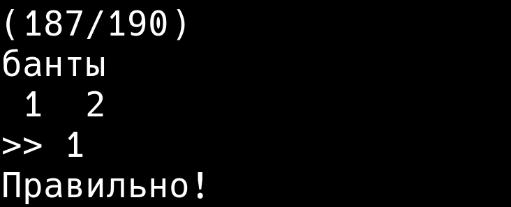

<div align="center">
  
</div>

## Описание

Консольная программа для изучения ударений в словах

## Функционал
 - тренажёр слов с выбором ударения
 - статистика

## Запуск

Для запуска требуется только `python` и два файла (`main.py`, `word.txt`) в одной директории

В терминале:

```shell
python3 main.py
```
